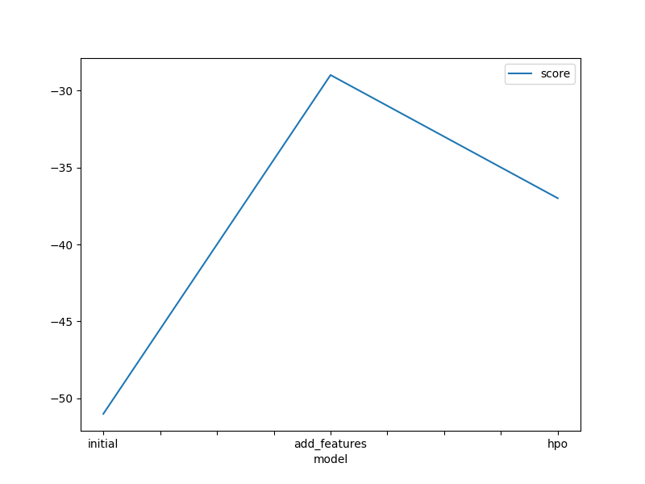
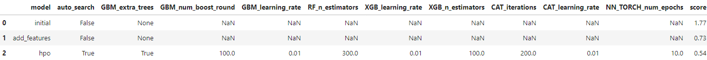

# Report: Predict Bike Sharing Demand with AutoGluon Solution
#### Vaishnavi Vinod Kumar

## Initial Training
### What did you realize when you tried to submit your predictions? What changes were needed to the output of the predictor to submit your results?
No changes were required to submit the predictions, it was suggested to remove any negative predictions but there were none.

### What was the top ranked model that performed?
WeightedEnsemble_L3  

## Exploratory data analysis and feature creation
### What did the exploratory analysis find and how did you add additional features?
Found out that datetime could be split into constituents, primarily the hour from the whole date.

### How much better did your model preform after adding additional features and why do you think that is?
The rmse error went down after the hour feature was created. Looking at the data it was visible that hour was more correlated to the demand and a good predictor. More category features could be introduced using one-hot encoding

## Hyper parameter tuning
### How much better did your model preform after trying different hyper parameters?
The score improved marginally after trying different hyper parameters. I tried setting the n_estimators/extra_trees/num_boost value to differnt levels 1/100/1000 to see the effect of underfitting/overfitting with the number of trees in the model. Also tried different learning rates to see the impact on the final result. 

### If you were given more time with this dataset, where do you think you would spend more time?
Would spend more time delving into hyper parameter optimization. Understand the important parameters of the successful models and try to change them and verify if we could reduce error. Also try each individual model separately to learn and get used to the whole workflow.

### Create a line plot showing the top model score for the three (or more) training runs during the project.

### Create a table with the models you ran, the hyperparameters modified, and the kaggle score.  
the project.

TODO: Replace image below with your own.

## Summary
TODO: Add your explanation
