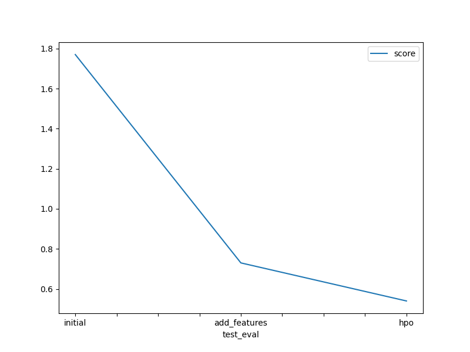

# Report: Predict Bike Sharing Demand with AutoGluon Solution
#### NAME HERE

## Initial Training
### What did you realize when you tried to submit your predictions? What changes were needed to the output of the predictor to submit your results?
No changes were required to submit the predictions, it was suggested to remove any negative predictions but there were none.

### What was the top ranked model that performed?
WeightedEnsemble_L3  

## Exploratory data analysis and feature creation
### What did the exploratory analysis find and how did you add additional features?
Found out that datetime could be split into constituents, primarily the hour from the whole date.

### How much better did your model preform after adding additional features and why do you think that is?
The rmse error went down after the hour feature was created. Looking at the data it was visible that hour was more correlated to the demand and a good predictor.

## Hyper parameter tuning
### How much better did your model preform after trying different hyper parameters?
The score improved marginally after trying different hyper parameters.

### If you were given more time with this dataset, where do you think you would spend more time?
Would spend more time delving into hyper parameter optimization. Understand the important parameters of the successful models and try to change them and verify if we could reduce error. Also try each individual model separately to learn and get used to the whole workflow.

### Create a table with the models you ran, the hyperparameters modified, and the kaggle score.  
| model               | initial | add_features | hpo     |
|---------------------|---------|--------------|---------|
| XGBoost_BAG_L2      | -54.81  | -30.77       | -32.82	 |
| LightGBM_BAG_L2     | -55.16  | -30.42       | -30.44  |
| CatBoost_BAG_L2     | -55.48  | -32.5        | -32.43  |
| score               | 1.77    | 0.73         | 0.50    |

## Summary
Was able to learn and implement a basic ML workflow. Autogluon looked really easy to use and gave an easy starting point to find good models for further optimization.
